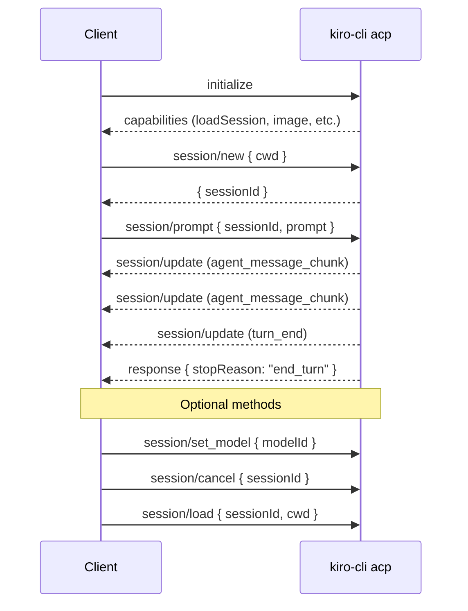
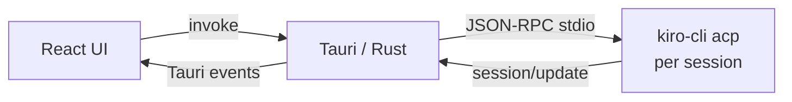
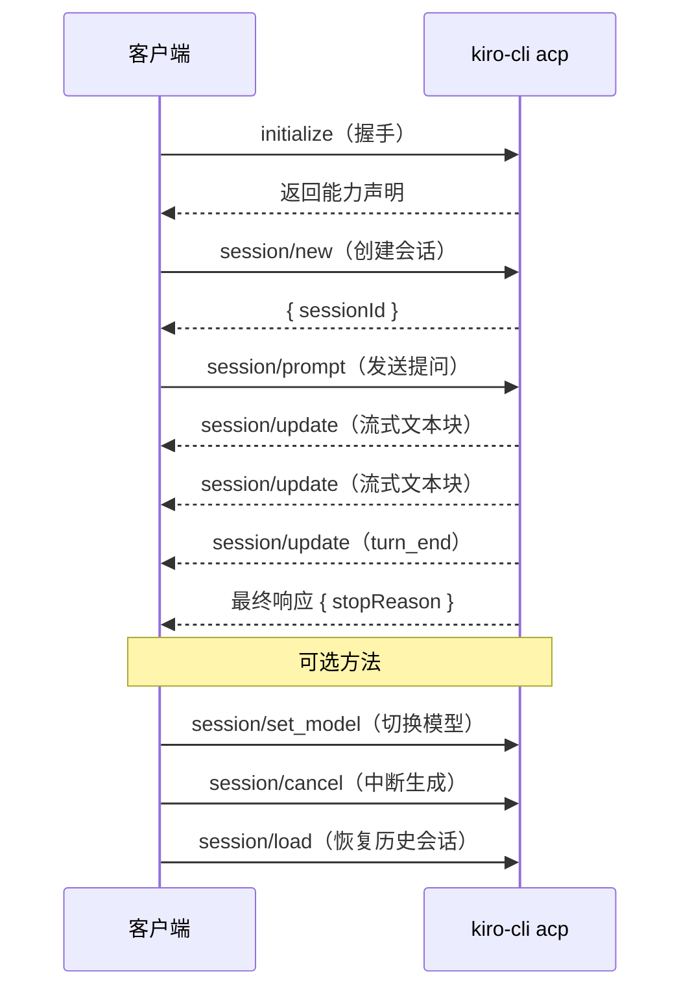

<p align="center">
  
</p>

<h1 align="center">KiroNotebook</h1>

<p align="center">
  Build AI-powered apps with <a href="https://kiro.dev/docs/cli/acp/">Kiro CLI</a> as your AI backend — via the Agent Client Protocol
</p>

<p align="center">
  <a href="#english">English</a> · <a href="#中文">中文</a>
</p>

---

<a id="english"></a>

## Using Kiro CLI as an AI SDK

Most AI applications require managing API keys, model endpoints, token billing, and SDK dependencies. **Kiro CLI changes this** — it exposes a fully-featured AI agent through the [Agent Client Protocol (ACP)](https://agentclientprotocol.com/), a JSON-RPC 2.0 interface over stdio.

This means you can:

- **Use Kiro CLI as your AI backend** — no API keys to manage, no SDKs to install
- **Build any kind of AI application** — desktop apps, CLI tools, editor plugins, automation scripts
- **Get agent capabilities for free** — tool use, streaming, session persistence, model switching
- **Work in any language** — anything that can spawn a process and read/write stdio (Rust, Python, Node.js, Go, etc.)

KiroNotebook is a reference implementation showing this approach in action — a local NotebookLM-style app that uses Kiro CLI as its only AI dependency.

## ACP Integration Guide

### Spawning the ACP Server

```rust
// Rust
let child = Command::new("kiro-cli")
    .arg("acp")
    .stdin(Stdio::piped())
    .stdout(Stdio::piped())
    .spawn()?;
```

```python
# Python
proc = subprocess.Popen(
    ["kiro-cli", "acp"],
    stdin=subprocess.PIPE, stdout=subprocess.PIPE, text=True
)
```

### Protocol Flow



### Key Methods

#### 1. Initialize

```json
{"jsonrpc":"2.0","id":0,"method":"initialize","params":{
  "protocolVersion":1,
  "clientCapabilities":{},
  "clientInfo":{"name":"my-app","version":"0.1.0"}
}}
```

#### 2. Create Session

```json
{"jsonrpc":"2.0","id":1,"method":"session/new","params":{
  "cwd":"/path/to/project",
  "mcpServers":[]
}}
```

#### 3. Send Prompt (Streaming)

```json
{"jsonrpc":"2.0","id":2,"method":"session/prompt","params":{
  "sessionId":"uuid-here",
  "prompt":[{"type":"text","text":"Explain this code"}]
}}
```

Streaming notifications arrive before the final response:

```json
{"jsonrpc":"2.0","method":"session/update","params":{
  "update":{"sessionUpdate":"agent_message_chunk","content":{"text":"Here's..."}}
}}
```

#### 4. Load Previous Session

Sessions persist at `~/.kiro/sessions/cli/`. Restore in a new process:

```json
{"jsonrpc":"2.0","id":1,"method":"session/load","params":{
  "sessionId":"uuid-from-before",
  "cwd":"/path/to/project",
  "mcpServers":[]
}}
```

#### 5. Switch Model

```json
{"jsonrpc":"2.0","id":3,"method":"session/set_model","params":{
  "sessionId":"uuid-here",
  "modelId":"claude-sonnet-4"
}}
```

Available: `auto`, `claude-sonnet-4.6`, `claude-opus-4.6`, `claude-sonnet-4.5`, `claude-opus-4.5`, `claude-sonnet-4`, `claude-haiku-4.5`

#### 6. Cancel Generation

```json
{"jsonrpc":"2.0","id":99,"method":"session/cancel","params":{
  "sessionId":"uuid-here"
}}
```

### Python Test Scripts

Standalone scripts for testing each ACP method — useful as reference implementations:

```bash
uv run temp/acp_01_new_session.py   # Create session + prompt
uv run temp/acp_02_load_session.py  # Load previous session
uv run temp/acp_03_set_model.py     # Switch model
uv run temp/acp_04_streaming.py     # Streaming with timing
```

## The App

KiroNotebook is a local NotebookLM — chat with AI about your documents without uploading anything.

- **Three-panel layout** — File tree, document preview, AI chat
- **Document support** — PDF, DOCX, Markdown, TXT, HTML
- **Per-session ACP processes** — Each chat tab runs its own `kiro-cli acp` instance
- **Context tracking** — Sent files marked with ✓, new files queued until next message
- **Session persistence** — Restorable with full ACP context via `session/load`
- **Streaming + cancel** — Real-time responses, interruptible mid-generation
- **Model switching** — All Kiro CLI models available

### Architecture



## Getting Started

**Prerequisites:** [Kiro CLI](https://kiro.dev/downloads/) (authenticated), Node.js 18+, [Rust](https://rustup.rs/)

```bash
git clone https://github.com/vokako/kiro-notebook.git
cd kiro-notebook
npm install
npm run tauri dev
```

### Build

```bash
npm run tauri build -- --bundles app
```

## Further Reading

- [Kiro CLI ACP Documentation](https://kiro.dev/docs/cli/acp/)
- [ACP Specification](https://agentclientprotocol.com/)
- [Tauri 2 Documentation](https://v2.tauri.app)

## License

MIT

---

<a id="中文"></a>

## 中文文档

### 把 Kiro CLI 当作 AI SDK 来用

开发 AI 应用通常需要管理 API Key、模型端点、Token 计费和各种 SDK 依赖。**Kiro CLI 改变了这一切** — 它通过 [Agent Client Protocol (ACP)](https://agentclientprotocol.com/) 暴露了一个完整的 AI Agent 能力，基于 JSON-RPC 2.0 协议，通过 stdio 通信。

这意味着你可以：

- **把 Kiro CLI 作为 AI 后端** — 无需管理 API Key，无需安装 SDK
- **构建任何类型的 AI 应用** — 桌面应用、CLI 工具、编辑器插件、自动化脚本
- **免费获得 Agent 能力** — 工具调用、流式输出、会话持久化、模型切换
- **使用任何编程语言** — 只要能启动子进程并读写 stdio（Rust、Python、Node.js、Go 等）

KiroNotebook 是这种方案的参考实现 — 一个本地版 NotebookLM，唯一的 AI 依赖就是 Kiro CLI。

### ACP 协议核心流程



### 核心方法

| 方法 | 用途 |
|------|------|
| `initialize` | 握手，交换能力声明 |
| `session/new` | 创建新会话 |
| `session/load` | 恢复历史会话（含完整上下文） |
| `session/prompt` | 发送消息，接收流式响应 |
| `session/cancel` | 中断生成 |
| `session/set_model` | 切换模型 |

### 快速开始

**前置条件：** [Kiro CLI](https://kiro.dev/downloads/)（已登录）、Node.js 18+、[Rust](https://rustup.rs/)

```bash
git clone https://github.com/vokako/kiro-notebook.git
cd kiro-notebook
npm install
npm run tauri dev
```

### 构建

```bash
npm run tauri build -- --bundles app
# 产物位于 src-tauri/target/release/bundle/macos/KiroNotebook.app
```

### Python 测试脚本

`temp/` 目录下有独立的 Python 脚本，可以直接测试每个 ACP 方法：

```bash
uv run temp/acp_01_new_session.py   # 创建会话 + 发送消息
uv run temp/acp_02_load_session.py  # 恢复历史会话
uv run temp/acp_03_set_model.py     # 切换模型
uv run temp/acp_04_streaming.py     # 流式输出（含耗时统计）
```

这些脚本也可以作为你开发 ACP 应用的起点。
