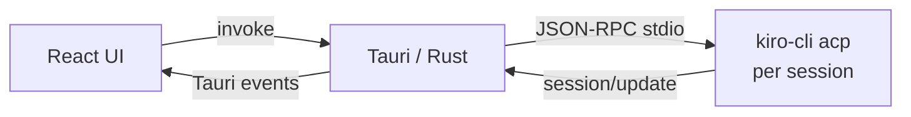
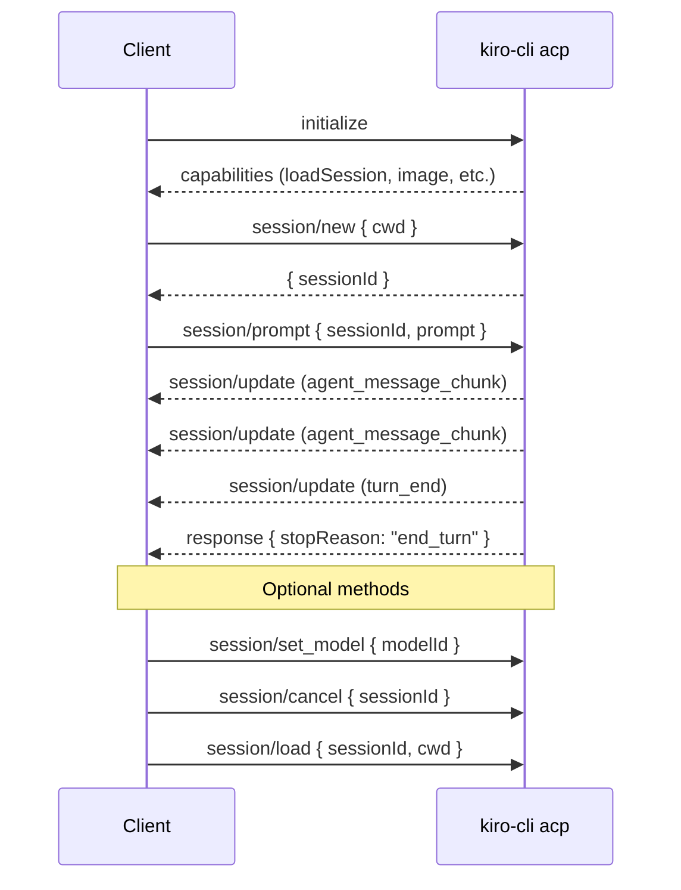

<p align="center">
  
</p>

<h1 align="center">KiroNotebook</h1>

<p align="center">
  Build AI-powered apps with <a href="https://kiro.dev/docs/cli/acp/">Kiro CLI</a> as your AI backend — via the Agent Client Protocol
</p>

<p align="center">
  <a href="doc/blog-kiro-acp-as-ai-sdk.md">Blog (EN)</a> · <a href="doc/blog-kiro-acp-as-ai-sdk-zh.md">Blog (中文)</a> · <a href="doc/acp-guide-zh.md">中文文档</a>
</p>

---

KiroNotebook is a local NotebookLM — chat with AI about your documents without uploading anything. It uses Kiro CLI as its only AI dependency via the [Agent Client Protocol (ACP)](https://agentclientprotocol.com/).


https://github.com/user-attachments/assets/5ebb9202-a9bf-4b0c-8c79-071e42096c3b


- **Three-panel layout** — File tree, document preview, AI chat
- **Document support** — PDF, DOCX, Markdown, TXT, HTML
- **Per-session ACP processes** — Each chat tab runs its own `kiro-cli acp` instance
- **Context tracking** — Sent files marked with ✓, new files queued until next message
- **Session persistence** — Restorable with full ACP context via `session/load`
- **Streaming + cancel** — Real-time responses, interruptible mid-generation
- **Model switching** — All Kiro CLI models available

## Architecture



## Getting Started

**Prerequisites:** [Kiro CLI](https://kiro.dev/downloads/) (authenticated), Node.js 18+, [Rust](https://rustup.rs/)

```bash
git clone https://github.com/vokako/kiro-notebook.git
cd kiro-notebook
npm install
npm run tauri dev
```

### Build

```bash
npm run tauri build -- --bundles app
```

## Using Kiro CLI as an AI SDK

Most AI applications require managing API keys, model endpoints, token billing, and SDK dependencies. **Kiro CLI changes this** — it exposes a fully-featured AI agent through the [Agent Client Protocol (ACP)](https://agentclientprotocol.com/), a JSON-RPC 2.0 interface over stdio.

This means you can:

- **Use Kiro CLI as your AI backend** — no API keys to manage, no SDKs to install
- **Build any kind of AI application** — desktop apps, CLI tools, editor plugins, automation scripts
- **Get agent capabilities for free** — tool use, streaming, session persistence, model switching
- **Work in any language** — anything that can spawn a process and read/write stdio (Rust, Python, Node.js, Go, etc.)

### Spawning the ACP Server

```rust
// Rust
let child = Command::new("kiro-cli")
    .arg("acp")
    .stdin(Stdio::piped())
    .stdout(Stdio::piped())
    .spawn()?;
```

```python
# Python
proc = subprocess.Popen(
    ["kiro-cli", "acp"],
    stdin=subprocess.PIPE, stdout=subprocess.PIPE, text=True
)
```

### Protocol Flow



### Key Methods

#### 1. Initialize

```json
{"jsonrpc":"2.0","id":0,"method":"initialize","params":{
  "protocolVersion":1,
  "clientCapabilities":{},
  "clientInfo":{"name":"my-app","version":"0.1.0"}
}}
```

#### 2. Create Session

```json
{"jsonrpc":"2.0","id":1,"method":"session/new","params":{
  "cwd":"/path/to/project",
  "mcpServers":[]
}}
```

#### 3. Send Prompt (Streaming)

```json
{"jsonrpc":"2.0","id":2,"method":"session/prompt","params":{
  "sessionId":"uuid-here",
  "prompt":[{"type":"text","text":"Explain this code"}]
}}
```

Streaming notifications arrive before the final response:

```json
{"jsonrpc":"2.0","method":"session/update","params":{
  "update":{"sessionUpdate":"agent_message_chunk","content":{"text":"Here's..."}}
}}
```

#### 4. Load Previous Session

Sessions persist at `~/.kiro/sessions/cli/`. Restore in a new process:

```json
{"jsonrpc":"2.0","id":1,"method":"session/load","params":{
  "sessionId":"uuid-from-before",
  "cwd":"/path/to/project",
  "mcpServers":[]
}}
```

#### 5. Switch Model

```json
{"jsonrpc":"2.0","id":3,"method":"session/set_model","params":{
  "sessionId":"uuid-here",
  "modelId":"claude-sonnet-4"
}}
```

Available: `auto`, `claude-sonnet-4.6`, `claude-opus-4.6`, `claude-sonnet-4.5`, `claude-opus-4.5`, `claude-sonnet-4`, `claude-haiku-4.5`

#### 6. Cancel Generation

```json
{"jsonrpc":"2.0","id":99,"method":"session/cancel","params":{
  "sessionId":"uuid-here"
}}
```

### Python Test Scripts

Standalone scripts for testing each ACP method — useful as reference implementations:

```bash
uv run acp-python-example/acp_01_new_session.py   # Create session + prompt
uv run acp-python-example/acp_02_load_session.py  # Load previous session
uv run acp-python-example/acp_03_set_model.py     # Switch model
uv run acp-python-example/acp_04_streaming.py     # Streaming with timing
```

## Further Reading

- [Kiro CLI ACP Documentation](https://kiro.dev/docs/cli/acp/)
- [ACP Specification](https://agentclientprotocol.com/)
- [Tauri 2 Documentation](https://v2.tauri.app)

## License

[MIT](LICENSE)
