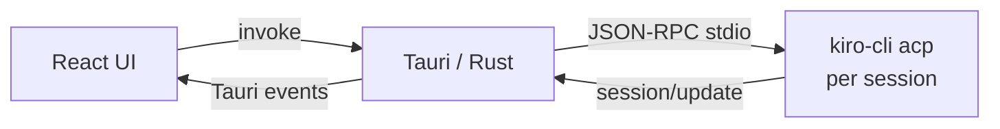

<p align="center">
  
</p>

<h1 align="center">KiroNotebook</h1>

<p align="center">
  Build AI-powered apps with <a href="https://kiro.dev/docs/cli/acp/">Kiro CLI</a> as your AI backend — via the Agent Client Protocol
</p>

<p align="center">
  <a href="doc/acp-guide.md">English Doc</a> · <a href="doc/acp-guide-zh.md">中文文档</a>
</p>

---

KiroNotebook is a local NotebookLM — chat with AI about your documents without uploading anything. It uses Kiro CLI as its only AI dependency via the [Agent Client Protocol (ACP)](https://agentclientprotocol.com/).

- **Three-panel layout** — File tree, document preview, AI chat
- **Document support** — PDF, DOCX, Markdown, TXT, HTML
- **Per-session ACP processes** — Each chat tab runs its own `kiro-cli acp` instance
- **Context tracking** — Sent files marked with ✓, new files queued until next message
- **Session persistence** — Restorable with full ACP context via `session/load`
- **Streaming + cancel** — Real-time responses, interruptible mid-generation
- **Model switching** — All Kiro CLI models available

## Architecture



## Getting Started

**Prerequisites:** [Kiro CLI](https://kiro.dev/downloads/) (authenticated), Node.js 18+, [Rust](https://rustup.rs/)

```bash
git clone https://github.com/vokako/kiro-notebook.git
cd kiro-notebook
npm install
npm run tauri dev
```

### Build

```bash
npm run tauri build -- --bundles app
```

## Documentation

- [ACP Integration Guide (English)](doc/acp-guide.md)
- [ACP 集成指南（中文）](doc/acp-guide-zh.md)

## License

[MIT](LICENSE)
