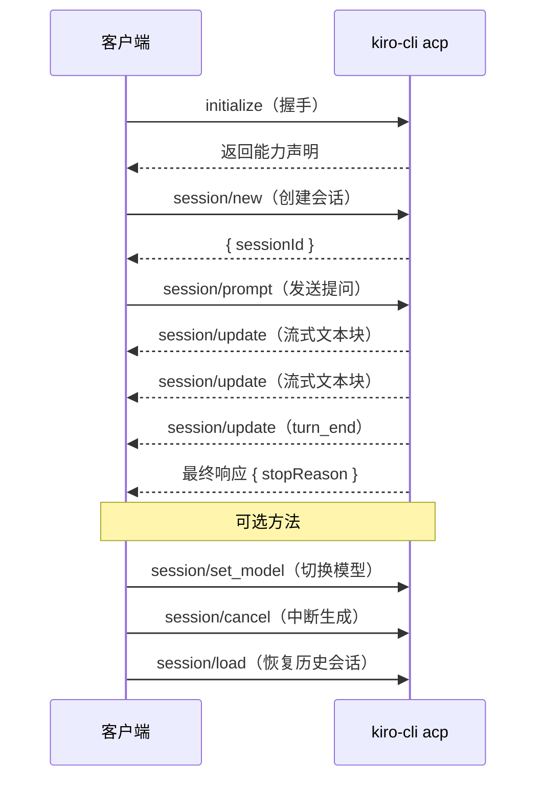

# ACP 集成指南

## 把 Kiro CLI 当作 AI SDK 来用

开发 AI 应用通常需要管理 API Key、模型端点、Token 计费和各种 SDK 依赖。**Kiro CLI 改变了这一切** — 它通过 [Agent Client Protocol (ACP)](https://agentclientprotocol.com/) 暴露了一个完整的 AI Agent 能力，基于 JSON-RPC 2.0 协议，通过 stdio 通信。

这意味着你可以：

- **把 Kiro CLI 作为 AI 后端** — 无需管理 API Key，无需安装 SDK
- **构建任何类型的 AI 应用** — 桌面应用、CLI 工具、编辑器插件、自动化脚本
- **免费获得 Agent 能力** — 工具调用、流式输出、会话持久化、模型切换
- **使用任何编程语言** — 只要能启动子进程并读写 stdio（Rust、Python、Node.js、Go 等）

## 启动 ACP 服务

```rust
// Rust
let child = Command::new("kiro-cli")
    .arg("acp")
    .stdin(Stdio::piped())
    .stdout(Stdio::piped())
    .spawn()?;
```

```python
# Python
proc = subprocess.Popen(
    ["kiro-cli", "acp"],
    stdin=subprocess.PIPE, stdout=subprocess.PIPE, text=True
)
```

## 协议核心流程



## 核心方法

| 方法 | 用途 |
|------|------|
| `initialize` | 握手，交换能力声明 |
| `session/new` | 创建新会话 |
| `session/load` | 恢复历史会话（含完整上下文） |
| `session/prompt` | 发送消息，接收流式响应 |
| `session/cancel` | 中断生成 |
| `session/set_model` | 切换模型 |

### 1. 初始化

```json
{"jsonrpc":"2.0","id":0,"method":"initialize","params":{
  "protocolVersion":1,
  "clientCapabilities":{},
  "clientInfo":{"name":"my-app","version":"0.1.0"}
}}
```

### 2. 创建会话

```json
{"jsonrpc":"2.0","id":1,"method":"session/new","params":{
  "cwd":"/path/to/project",
  "mcpServers":[]
}}
```

### 3. 发送消息（流式）

```json
{"jsonrpc":"2.0","id":2,"method":"session/prompt","params":{
  "sessionId":"uuid-here",
  "prompt":[{"type":"text","text":"解释这段代码"}]
}}
```

流式通知在最终响应之前到达：

```json
{"jsonrpc":"2.0","method":"session/update","params":{
  "update":{"sessionUpdate":"agent_message_chunk","content":{"text":"这是..."}}
}}
```

### 4. 恢复历史会话

会话持久化在 `~/.kiro/sessions/cli/`，可在新进程中恢复：

```json
{"jsonrpc":"2.0","id":1,"method":"session/load","params":{
  "sessionId":"uuid-from-before",
  "cwd":"/path/to/project",
  "mcpServers":[]
}}
```

### 5. 切换模型

```json
{"jsonrpc":"2.0","id":3,"method":"session/set_model","params":{
  "sessionId":"uuid-here",
  "modelId":"claude-sonnet-4"
}}
```

可用模型：`auto`、`claude-sonnet-4.6`、`claude-opus-4.6`、`claude-sonnet-4.5`、`claude-opus-4.5`、`claude-sonnet-4`、`claude-haiku-4.5`

### 6. 中断生成

```json
{"jsonrpc":"2.0","id":99,"method":"session/cancel","params":{
  "sessionId":"uuid-here"
}}
```

## Python 测试脚本

`acp-python-example/` 目录下有独立的 Python 脚本，可以直接测试每个 ACP 方法：

```bash
uv run acp-python-example/acp_01_new_session.py   # 创建会话 + 发送消息
uv run acp-python-example/acp_02_load_session.py  # 恢复历史会话
uv run acp-python-example/acp_03_set_model.py     # 切换模型
uv run acp-python-example/acp_04_streaming.py     # 流式输出（含耗时统计）
```

这些脚本也可以作为你开发 ACP 应用的起点。

## 参考链接

- [Kiro CLI ACP 文档](https://kiro.dev/docs/cli/acp/)
- [ACP 协议规范](https://agentclientprotocol.com/)
- [Tauri 2 文档](https://v2.tauri.app)
