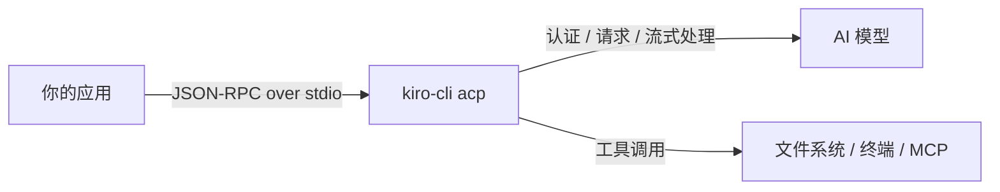
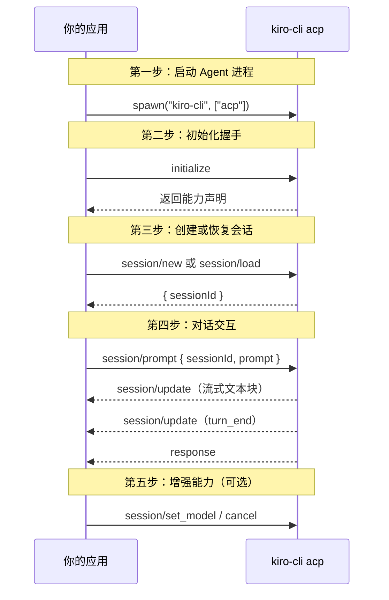
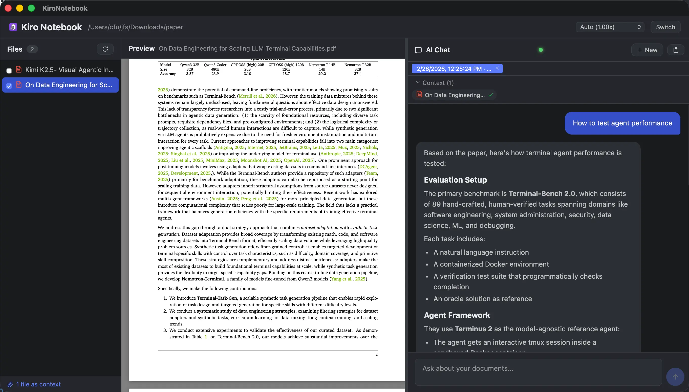
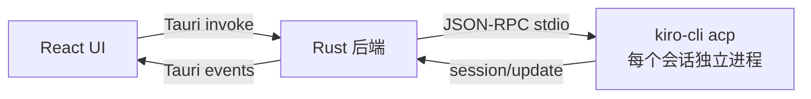

# 把 Kiro CLI 当作 Agent SDK：用 ACP 协议构建 Agent 应用

*无需 API Key，无需 SDK 依赖，一个 Kiro CLI 就是你的 Agent 后端。*

---

## 1. 背景

[Kiro](https://kiro.dev/) 是 AWS 推出的 AI 编程助手，提供 IDE 插件和命令行工具两种使用方式。Kiro CLI 让开发者在终端中直接与 AI Agent 交互，完成代码编写、项目分析、任务执行等工作。

随着 AI 应用开发的普及，越来越多的开发者希望在自己的应用中集成类似的 Agent 能力。然而，构建 AI 应用的起步成本并不低——申请 API Key、选择 SDK、处理认证和计费、实现流式输出……这些基础设施工作往往在写下第一行业务逻辑之前就消耗了大量时间。

为了让更多应用能够复用 Kiro 的 Agent 能力，Kiro CLI 现在实现了 [Agent Client Protocol (ACP)](https://agentclientprotocol.com/)——一个标准化 AI Agent 与客户端通信的开放协议。ACP 的设计理念类似于 [Language Server Protocol (LSP)](https://microsoft.github.io/language-server-protocol/)：LSP 让任何编辑器都能接入任何语言服务器，而 ACP 则让任何客户端都能接入任何 AI Agent。协议基于 JSON-RPC 2.0，定义了会话管理、流式输出、工具调用、模型切换等核心能力。

这意味着，任何能够启动子进程并进行 stdio 通信的应用，都可以把 Kiro CLI 当作自己的 Agent 后端——无需申请 API Key，无需安装额外的 SDK，也无需关心底层模型的调用细节。

## 2. 核心思路：从调用 API 到对话 Agent

Kiro CLI 的 ACP 支持提供了一种不同于传统 SDK 集成的思路：你的应用不再直接调用模型 API，而是与一个本地运行的 Agent 进程通信。这个进程就是 `kiro-cli acp`，它封装了所有与模型交互的复杂性——你的应用只需要说 JSON-RPC。



这种架构带来几个显著优势：

- **零配置接入**：Kiro CLI 已处理认证，你的应用不需要管理任何凭证
- **语言无关**：任何能启动子进程的语言都可以作为客户端
- **能力完整**：你获得的是一个完整的 AI Agent，具备工具调用、上下文管理、会话持久化等能力
- **关注点分离**：AI 交互的复杂性被封装在 Agent 进程中，应用代码只需关注业务逻辑

## 3. 五步构建一个 ACP 应用

让我们通过一个完整的流程来看如何将 Kiro CLI 接入你的应用。



### 3.1 启动 Agent 进程

一切从启动 `kiro-cli acp` 子进程开始。前提是用户已经 [安装并登录了 Kiro CLI](https://kiro.dev/downloads/)。你的应用需要创建这个进程，并建立 stdin/stdout 通信通道。如果需要使用特定的 Agent 配置，可以通过 `--agent` 参数指定：

```rust
// Rust
let child = Command::new("kiro-cli")
    .arg("acp")
    .stdin(Stdio::piped())
    .stdout(Stdio::piped())
    .spawn()?;
```

```python
# Python
import subprocess
proc = subprocess.Popen(
    ["kiro-cli", "acp"],
    stdin=subprocess.PIPE, stdout=subprocess.PIPE, text=True
)
```

```javascript
// Node.js
const { spawn } = require("child_process");
const agent = spawn("kiro-cli", ["acp"], { stdio: ["pipe", "pipe", "pipe"] });
```

### 3.2 初始化握手

进程启动后，发送 `initialize` 请求完成握手。双方交换能力声明——客户端告诉 Agent 自己支持哪些功能，Agent 返回它的能力（如会话恢复、图片输入等）：

```json
{"jsonrpc":"2.0","id":0,"method":"initialize","params":{
  "protocolVersion":1,
  "clientCapabilities":{},
  "clientInfo":{"name":"my-app","version":"0.1.0"}
}}
```

### 3.3 创建或恢复会话

通过 `session/new` 创建新会话，或通过 `session/load` 恢复之前的会话。每个会话拥有唯一的 `sessionId`，后续交互都在这个上下文中进行。`cwd` 指定 Agent 的工作目录，`mcpServers` 可传入 MCP 服务器扩展工具能力：

```json
{"jsonrpc":"2.0","id":1,"method":"session/new","params":{
  "cwd":"/path/to/project",
  "mcpServers":[]
}}
```

恢复已有会话（会话数据持久化在 `~/.kiro/sessions/cli/`）：

```json
{"jsonrpc":"2.0","id":1,"method":"session/load","params":{
  "sessionId":"uuid-from-before",
  "cwd":"/path/to/project"
}}
```

### 3.4 对话交互

通过 `session/prompt` 发送消息。ACP 原生支持流式输出——Agent 在生成过程中持续发送 `session/update` 通知，客户端可实时渲染。Agent 还可能调用工具完成任务，协议通过 `ToolCall` 更新让客户端追踪执行进度：

```json
{"jsonrpc":"2.0","id":2,"method":"session/prompt","params":{
  "sessionId":"uuid-here",
  "prompt":[{"type":"text","text":"解释这段代码"}]
}}
```

### 3.5 增强能力（可选）

根据应用需求，选择性接入增强能力：

**模型切换** — 会话中动态更换模型（支持 `auto`、`claude-sonnet-4`、`claude-opus-4.5` 等）：

```json
{"jsonrpc":"2.0","id":3,"method":"session/set_model","params":{
  "sessionId":"uuid-here","modelId":"claude-sonnet-4"
}}
```

**中断生成** — 随时取消正在进行的生成：

```json
{"jsonrpc":"2.0","id":99,"method":"session/cancel","params":{
  "sessionId":"uuid-here"
}}
```

此外，Kiro CLI 还提供了一些扩展能力（以 `_kiro.dev/` 为前缀），包括斜杠命令执行、MCP 服务器事件通知、上下文压缩状态等。这些扩展是可选的，不支持的客户端可以安全忽略。

会话数据持久化在 `~/.kiro/sessions/cli/`，日志输出到系统临时目录（macOS 为 `$TMPDIR/kiro-log/`），方便调试和问题排查。更多协议细节请参考 [Kiro CLI ACP 文档](https://kiro.dev/docs/cli/acp/)。

## 4. 示例项目：KiroNotebook

[KiroNotebook](https://github.com/vokako/kiro-notebook) 是一个类似 Google NotebookLM 的本地文档对话应用。用户可以导入 PDF、Word、Markdown 等文档，然后与 AI 讨论文档内容——所有数据都留在本地，不会上传到云端。

在这个应用中，Kiro CLI 承担了所有 AI 相关的工作：理解用户问题、分析文档内容、生成回答、维护对话上下文。应用本身只需要做三件事——管理 ACP 进程生命周期、转发 JSON-RPC 消息、渲染流式响应。整个项目没有引入任何 AI SDK，也没有一行直接调用模型 API 的代码。





仓库中还提供了 [Python 参考脚本](https://github.com/vokako/kiro-notebook/tree/main/acp-python-example)，演示创建会话、恢复会话、切换模型和流式输出等核心方法，适合作为构建 ACP 客户端的起点。

## 5. 总结

Kiro CLI 的 ACP 支持为 Agent 应用开发提供了一条新路径：将命令行工具转变为可编程的 Agent 后端，通过标准化协议暴露完整能力。开发者可以跳过 AI 基础设施的前期投入，专注于应用本身的业务逻辑和用户体验。

这种方案特别适合以下场景：

- **本地开发工具和 CLI** — 构建代码分析、文档生成、项目脚手架等开发者工具，用户已经安装了 Kiro CLI，可以直接复用其 Agent 能力
- **桌面应用** — 需要 AI 能力但不想管理云端 API 的本地应用，如文档助手、知识库问答、代码审查工具等
- **编辑器和 IDE 插件** — ACP 本身就是为编辑器集成设计的，JetBrains IDEs 和 Zed 已原生支持 Kiro 作为 ACP Agent
- **内部工具和原型验证** — 快速验证 AI 应用想法，无需前期投入 API 配额和计费基础设施
- **自动化脚本** — 在 CI/CD 流程或批处理脚本中集成 AI 能力

安装 [Kiro CLI](https://kiro.dev/downloads/)，运行 `kiro-cli acp`，开始构建你的下一个 Agent 应用。

## 参考链接

- [Kiro CLI ACP 文档](https://kiro.dev/docs/cli/acp/)
- [Agent Client Protocol 协议规范](https://agentclientprotocol.com/)
- [KiroNotebook 源码](https://github.com/vokako/kiro-notebook)
- [Kiro CLI 下载](https://kiro.dev/downloads/)
