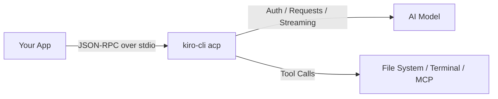
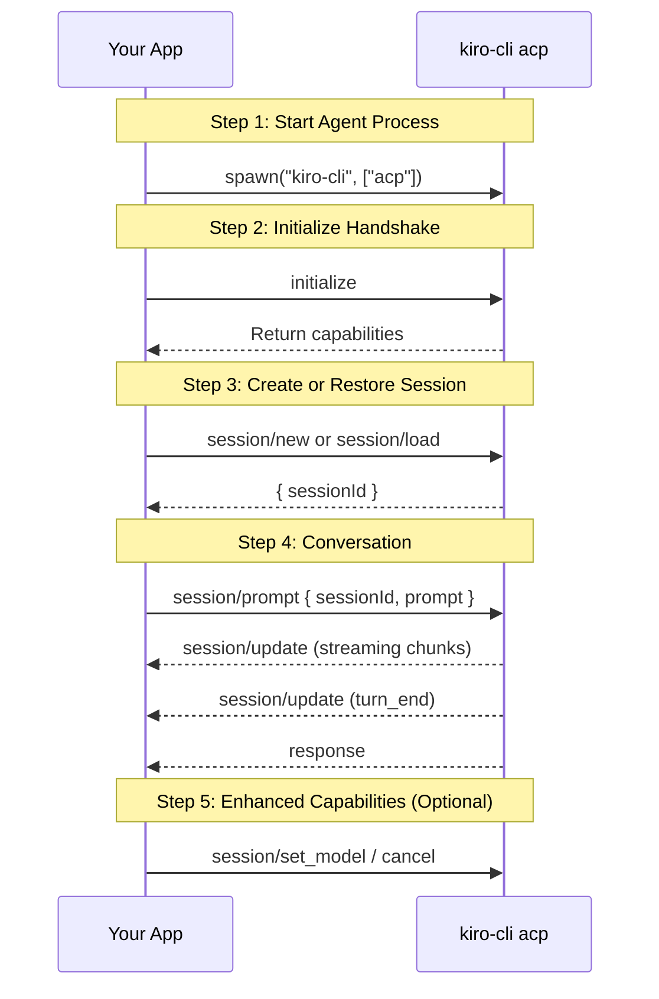
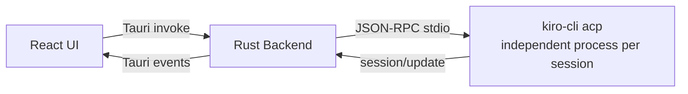

# Use Kiro CLI as an Agent SDK: Build Agent Apps with the ACP Protocol

*No API keys, no SDK dependencies — one Kiro CLI is your Agent backend.*

---

## 1. Background

[Kiro](https://kiro.dev/) is an AI coding assistant from AWS, available as both an IDE plugin and a command-line tool. Kiro CLI lets developers interact with an AI Agent directly from the terminal — writing code, analyzing projects, and executing tasks without leaving the command line.

As AI application development becomes more widespread, more developers want to integrate similar Agent capabilities into their own applications. However, the startup cost of building an AI app is not trivial — obtaining API keys, choosing an SDK, handling authentication and billing, implementing streaming output... These infrastructure tasks often consume significant time before a single line of business logic is written.

To lower this barrier, Kiro CLI now implements the [Agent Client Protocol (ACP)](https://agentclientprotocol.com/) — an open protocol that standardizes communication between AI Agents and clients. ACP's design philosophy is similar to the [Language Server Protocol (LSP)](https://microsoft.github.io/language-server-protocol/): LSP lets any editor connect to any language server, while ACP lets any client connect to any AI Agent. Built on JSON-RPC 2.0, the protocol defines core capabilities including session management, streaming output, tool invocation, and model switching.

This means any application that can spawn a subprocess and communicate via stdio can use Kiro CLI as its Agent backend — no API keys, no additional SDKs, and no need to worry about the underlying model details.

## 2. Core Idea: From Calling APIs to Talking to an Agent

Kiro CLI's ACP support offers a fundamentally different approach from traditional SDK integration: your application no longer calls model APIs directly, but instead communicates with a locally running Agent process. That process is `kiro-cli acp`, which encapsulates all the complexity of model interaction — your application just speaks JSON-RPC.



This architecture brings several key advantages:

- **Zero-config integration**: Kiro CLI handles authentication — your app doesn't need to manage any credentials
- **Language-agnostic**: Any language that can spawn a subprocess can be a client
- **Full capabilities**: You get a complete AI Agent with tool invocation, context management, and session persistence
- **Separation of concerns**: AI interaction complexity is encapsulated in the Agent process — your app code focuses on business logic

## 3. Build an ACP App in Five Steps

Let's walk through the complete flow of integrating Kiro CLI into your application.



### 3.1 Start the Agent Process

Everything begins with spawning the `kiro-cli acp` subprocess. The prerequisite is that the user has [installed and signed in to Kiro CLI](https://kiro.dev/downloads/). Your application creates this process and establishes stdin/stdout communication channels. Use the `--agent` parameter to specify a particular Agent configuration if needed:

```rust
// Rust
let child = Command::new("kiro-cli")
    .arg("acp")
    .stdin(Stdio::piped())
    .stdout(Stdio::piped())
    .spawn()?;
```

```python
# Python
import subprocess
proc = subprocess.Popen(
    ["kiro-cli", "acp"],
    stdin=subprocess.PIPE, stdout=subprocess.PIPE, text=True
)
```

```javascript
// Node.js
const { spawn } = require("child_process");
const agent = spawn("kiro-cli", ["acp"], { stdio: ["pipe", "pipe", "pipe"] });
```

### 3.2 Initialize Handshake

After the process starts, send an `initialize` request to complete the handshake. Both sides exchange capability declarations — the client tells the Agent what features it supports, and the Agent returns its capabilities (such as session restoration, image input, etc.):

```json
{"jsonrpc":"2.0","id":0,"method":"initialize","params":{
  "protocolVersion":1,
  "clientCapabilities":{},
  "clientInfo":{"name":"my-app","version":"0.1.0"}
}}
```

### 3.3 Create or Restore a Session

Create a new session with `session/new`, or restore a previous one with `session/load`. Each session has a unique `sessionId`, and all subsequent interactions happen within that context. `cwd` specifies the Agent's working directory, and `mcpServers` allows passing in MCP servers to extend tool capabilities:

```json
{"jsonrpc":"2.0","id":1,"method":"session/new","params":{
  "cwd":"/path/to/project",
  "mcpServers":[]
}}
```

Restore an existing session (session data persists at `~/.kiro/sessions/cli/`):

```json
{"jsonrpc":"2.0","id":1,"method":"session/load","params":{
  "sessionId":"uuid-from-before",
  "cwd":"/path/to/project"
}}
```

### 3.4 Conversation

Send messages with `session/prompt`. ACP natively supports streaming — the Agent continuously sends `session/update` notifications during generation, which the client can render in real time. The Agent may also invoke tools to complete tasks, with the protocol providing `ToolCall` updates for the client to track execution progress:

```json
{"jsonrpc":"2.0","id":2,"method":"session/prompt","params":{
  "sessionId":"uuid-here",
  "prompt":[{"type":"text","text":"Explain this code"}]
}}
```

### 3.5 Enhanced Capabilities (Optional)

Selectively integrate enhanced capabilities based on your application's needs:

**Model switching** — Dynamically change models mid-session (supports `auto`, `claude-sonnet-4`, `claude-opus-4.5`, etc.):

```json
{"jsonrpc":"2.0","id":3,"method":"session/set_model","params":{
  "sessionId":"uuid-here","modelId":"claude-sonnet-4"
}}
```

**Cancel generation** — Interrupt an in-progress generation at any time:

```json
{"jsonrpc":"2.0","id":99,"method":"session/cancel","params":{
  "sessionId":"uuid-here"
}}
```

Kiro CLI also provides extension capabilities (prefixed with `_kiro.dev/`), including slash command execution, MCP server event notifications, and context compaction status. These extensions are optional — clients that don't support them can safely ignore them.

Session data persists at `~/.kiro/sessions/cli/`, and logs are written to the system temp directory (on macOS: `$TMPDIR/kiro-log/`), making debugging straightforward. For more protocol details, see the [Kiro CLI ACP documentation](https://kiro.dev/docs/cli/acp/).

## 4. Example Project: KiroNotebook

[KiroNotebook](https://github.com/vokako/kiro-notebook) is a local document chat application similar to Google NotebookLM. Users can import PDF, Word, Markdown, and other documents, then discuss the content with AI.

In this application, Kiro CLI handles all AI-related work: understanding user questions, analyzing document content, generating answers, and maintaining conversation context. The application itself only needs to do three things — manage ACP process lifecycles, forward JSON-RPC messages, and render streaming responses. The entire project contains no AI SDK and not a single line of code that directly calls a model API.

<video src="https://github.com/vokako/kiro-notebook/raw/main/doc/screenshot_3x_720p.mp4" autoplay loop muted playsinline width="100%"></video>



The repository also includes [Python reference scripts](https://github.com/vokako/kiro-notebook/tree/main/acp-python-example) demonstrating core ACP methods — creating sessions, restoring sessions, switching models, and streaming output — suitable as a starting point for building your own ACP client.

## 5. Summary

Kiro CLI's ACP support offers a new path for Agent application development: turning a command-line tool into a programmable Agent backend that exposes full capabilities through a standardized protocol. Developers can skip the upfront investment in AI infrastructure and focus on business logic and user experience.

This approach is particularly well-suited for:

- **Local dev tools and CLIs** — Build code analysis, doc generation, and scaffolding tools that reuse Kiro CLI's Agent capabilities
- **Desktop applications** — Local apps that need AI without managing cloud APIs, such as document assistants, knowledge base Q&A, and code review tools
- **Editor and IDE plugins** — ACP is designed for editor integration; JetBrains IDEs and Zed already natively support Kiro as an ACP Agent
- **Internal tools and prototyping** — Quickly validate AI app ideas without upfront API quota and billing infrastructure
- **Automation scripts** — Integrate AI capabilities into CI/CD pipelines or batch processing scripts

Install [Kiro CLI](https://kiro.dev/downloads/) and make it the AI engine behind your next Agent application.

## References

- [Kiro CLI ACP Documentation](https://kiro.dev/docs/cli/acp/)
- [Agent Client Protocol Specification](https://agentclientprotocol.com/)
- [KiroNotebook Source Code](https://github.com/vokako/kiro-notebook)
- [Kiro CLI Downloads](https://kiro.dev/downloads/)
